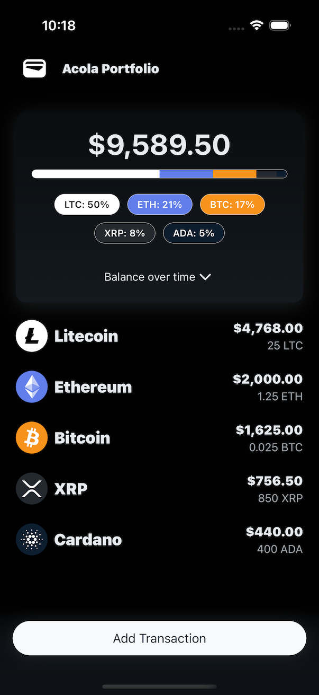
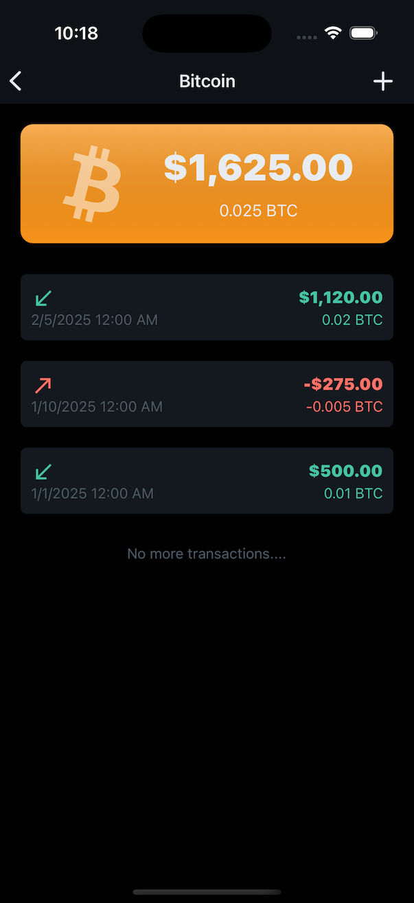
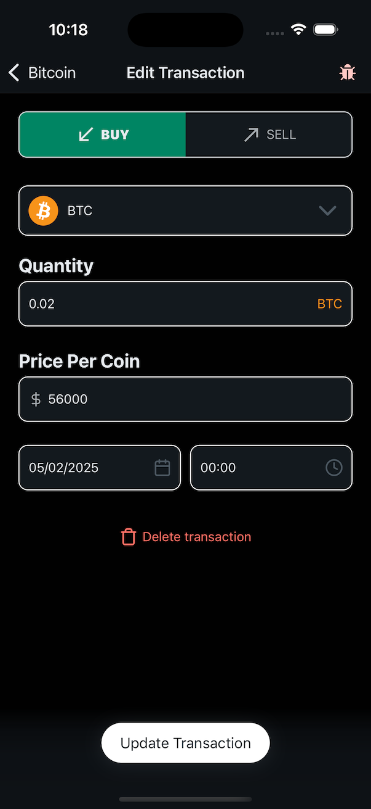

# Bitrefill - Home Assignment: Crypto Portfolio Manager

▶︎ [41s VIDEO DEMO](https://www.youtube.com/shorts/EbWUFdC_Ow8) (Unlisted Youtube video)

<p align="center">
  
  
  
</p>

## Features
* ✅ Portfolio Overview Screen
* ✅ Coin Purchases Scree
* ✅ Add Transaction Screen
* ✅ Portfolio Value Over Time Chart
* ✅ Edit Transaction Feature
* ✅ Delete Transaction Feature

## Prerequisites

Visit the official Expo documentation and follow the [setup instructions](https://docs.expo.dev/get-started/set-up-your-environment/?mode=development-build&platform=ios&device=simulated) for your operating system and platform.


## Running the project

1. Clone repository
   ```bash
   git clone https://github.com/adrianocola/bitrefill-take-home-mobile.git
   cd bitrefill-take-home-mobile

   ```
2. Install dependencies
   ```bash
   npm install
   ```

3. Start the app 

   ```bash
    npm run ios
   # or 
   # npm run android  
   ```
   
4. Hire me 😁

## Debug page 🐞
A debug page is accessible by tapping the bug icon on the "Add/Edit Transaction" screen (third screenshot).
This page allows you to:

* View the number of transactions in the database.
* Create random transactions.
* Reset the database. 

## Tech
* [React-Native](https://reactnative.dev/) + [Expo](https://expo.dev/)
* [Sqlite](https://docs.expo.dev/versions/latest/sdk/sqlite/) + [Drizzle ORM](https://orm.drizzle.team/)
* [React Native UI Lib](https://wix.github.io/react-native-ui-lib/)
* [React Native Reanimated](https://docs.swmansion.com/react-native-reanimated/)
* [React Native Gifted Charts](https://gifted-charts.web.app/)

## Solutions
* Database
  * Used SQLite with Drizzle’s [useLiveQuery](https://orm.drizzle.team/docs/connect-expo-sqlite#live-queries) for real-time update notifications.
  * Initially, the database handled balance aggregation by coin for the home screen, but I moved this logic to the JavaScript side.
  * This change was necessary to make the Portfolio Value Over Time Chart work properly.
* Optimization Approach
  * Focused on memoizing only necessary list items, avoiding premature optimizations.
  * Tested the app with tens of thousands of transactions, and it performed well, updating balances and charts in real-time.
* State Management
  * Introduced a state manager only when needed—specifically to refresh the coin transactions screen after adding a new transaction.
  * Chose [Jotai](https://jotai.org/) for its simplicity and ease of use, ensuring smooth data syncing between the relevant screens.
